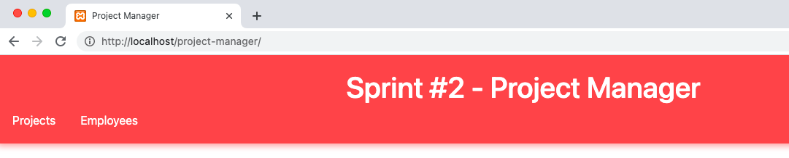

# SP2-Project-Manager

Sprint #2 - Project Manager

The second PHP sprint task is to create a CRUD (create/read/update/delete data from database) application in which projects and employees data are stored in a MySQL database.

## Requirements

- PHP 5.2 or higher.
- [Zip extension](http://php.net/manual/en/book.zip.php) for zip and unzip actions
- [MySQL](https://dev.mysql.com/downloads/installer/) Database Service
- [XAMPP](https://www.apachefriends.org/download.html), [AMPPS](https://ampps.com/download) or other open-source web server platform

## Installation & Configuration

1. Download ZIP with latest version from master branch or clone repository https
2. Copy all the files to your website (XAMPP/AMPPS/other) folder
3. Execute the following SQL query to create a tables with default data inside your MySQL database. For more SQL query info use `sql` folder

```
    CREATE DATABASE IF NOT EXISTS sprint2;
    USE sprint2;

    CREATE TABLE projects (
    p_id int NOT NULL AUTO_INCREMENT,
    p_name varchar(255) DEFAULT NULL,
    PRIMARY KEY (p_id)
    ) ENGINE=InnoDB AUTO_INCREMENT=22 DEFAULT CHARSET=utf8mb4 COLLATE=utf8mb4_0900_ai_ci;

    INSERT INTO projects VALUES (1,'PHP course'),(2,'Java course'),(3,'C# course'),(5,'.NET course'),(19,'JavaScript course');

    CREATE TABLE employees (
    e_id int NOT NULL AUTO_INCREMENT,
    e_name varchar(255) DEFAULT NULL,
    pro_id int DEFAULT NULL,
    PRIMARY KEY (e_id),
    KEY employees_ibfk_1 (pro_id),
    CONSTRAINT employees_ibfk_1 FOREIGN KEY (pro_id) REFERENCES projects (p_id) ON DELETE SET NULL ON UPDATE CASCADE,
    CONSTRAINT employees_ibfk_2 FOREIGN KEY (pro_id) REFERENCES projects (p_id) ON DELETE SET NULL ON UPDATE CASCADE
    ) ENGINE=InnoDB AUTO_INCREMENT=40 DEFAULT CHARSET=utf8mb4 COLLATE=utf8mb4_0900_ai_ci;

    INSERT INTO employees VALUES (1,'Ona',19),(2,'Petras',5),(3,'Jonas',NULL),(4,'Vytis',1),(6,'Juozas',5),(7,'Sigitas',NULL),(8,'Mindaugas',3),(9,'Jurgita',1);
```

4. Update `db_connection.php` file with your own MySQL connection parameters

```
    $servername = "127.0.0.1"; // change to your own server name, for example "localhost"
    $username = "root"; // default username is root; if other change to your own
    $password = "mysqlroot"; // change to your own server password
```

5. Open project with web browser (e.g. http://localhost/project-manager/)

## Project Features

### Ability to:

<ul>
<li> See all projects and employees information in separate pages</li>
<li> Update projects table: add/delete/update project data</li>
<li> Update employees table: add/delete/update employee data and assign project to employee</li>
</ul>




## Authors

[Jurgita](https://github.com/Jjurgita)
